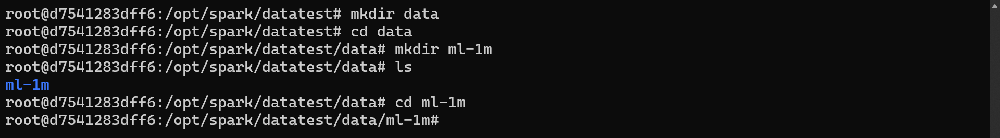
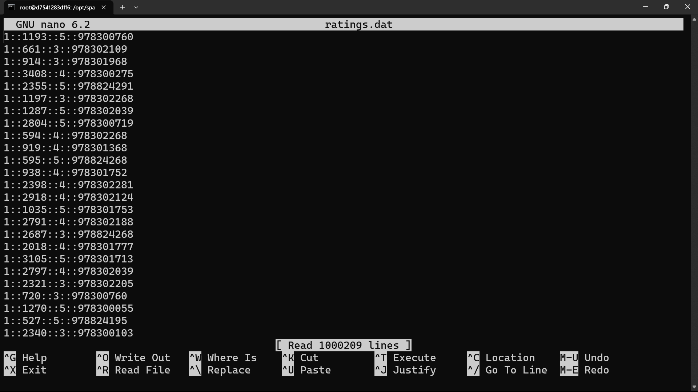

# Description

Repository ini berisi implementasi tugas menggunakan Spark MLlib dengan melakukan percobaan yang serupa dengan yang dilakukan di CloudxLab. Repository ini dirancang untuk membantu pengguna mempelajari dan mempraktekkan Spark MLlib dengan contoh-contoh yang mirip dengan yang ada di CloudxLab.

  
## Folder & Data

  
# Movie Lens Ratings

  <pre>
    <code>
import org.apache.spark.ml.recommendation.ALS
case class Rating(userId: Int, movieId: Int, rating: Float, timestamp: Long)
def parseRating(str: String): Rating = {
  val fields = str.split("::")
  assert(fields.size == 4)
  Rating(fields(0).toInt, fields(1).toInt, fields(2).toFloat, fields(3).toLong)
}
parseRating("1::1193::5::978300760")
var raw = sc.textFile("/data/ml-1m/ratings.dat")
raw.take(1)
val ratings = raw.map(parseRating).toDF()
ratings.show(5)
val Array(training, test) = ratings.randomSplit(Array(0.8, 0.2))
val als = new ALS().setMaxIter(5).setRegParam(0.01).setUserCol("userId").setItemCol("movieId").setRatingCol("rating")
val model = als.fit(training)
model.save("mymodel")
val predictions = model.transform(test)
predictions.map(r => r(2).asInstanceOf[Float] - r(4).asInstanceOf[Float])
.map(x => x*x)
.filter(!_.isNaN)
.reduce(_ + _)
predictions.take(10)
predictions.write.format("com.databricks.spark.csv").save("ml-predictions.csv")
    </code>
  </pre>
  

  Apache Spark MLlib untuk membangun sistem rekomendasi dengan Collaborative Filtering menggunakan model ALS. Langkah-langkahnya meliputi mengurai data rating menjadi objek Rating, membaca data rating dari file, mengubahnya menjadi DataFrame, membagi data menjadi subset training dan test, melatih model ALS dengan data training, melakukan prediksi pada data test, menghitung error prediksi, dan menyimpan hasil prediksi ke dalam file CSV.
  

  
# Movie Lens Reco (2.0)

  <pre>
    <code>
import org.apache.spark.mllib.recommendation._
import org.apache.spark.mllib.linalg.Vectors

var raw = sc.textFile("ratings.dat")
var mydata = Seq((2, 0.01))
var mydatardd = sc.parallelize(mydata).map(x => Rating(0, x._1, x._2))

def parseRating(str: String): Rating = {
  val fields = str.split("::")
  assert(fields.size == 4)
  Rating(fields(0).toInt, fields(1).toInt, fields(2).toFloat)
}

val ratings = raw.map(parseRating)
val totalratings = ratings.union(mydatardd)

val rank = 8
val iterations = 5
val lambda = 1.0
val model = ALS.train(totalratings, rank, iterations, lambda)

val products = model.recommendProducts(1, 10)
val vectors = products.map(p => Vectors.dense(p.product, p.rating)) 

val outputPath = "products.csv"
val lines = vectors.map(v => v.toArray.mkString(","))
val linesRDD = sc.parallelize(lines)
linesRDD.coalesce(1).saveAsTextFile(outputPath)
    </code>
  </pre>
  

   Apache Spark's MLlib library untuk melatih model Collaborative Filtering dengan metode ALS dan menghasilkan rekomendasi produk berdasarkan data rating. Langkah-langkahnya meliputi membaca file data rating, menggabungkan data rating dengan data baru, menentukan parameter-model dan melatih model ALS, membuat rekomendasi produk untuk pengguna tertentu, dan menyimpan hasil rekomendasi dalam format CSV.
  

  
# Basic Statistic Summary

  <pre>
    <code>
from pyspark import SparkContext
from pyspark.mllib.linalg import Vectors
from pyspark.mllib.stat import Statistics

sc = SparkContext.getOrCreate()

vectors = sc.textFile("products.csv").map(lambda line: Vectors.dense(line.split(',')))

summary = Statistics.colStats(vectors)
mean = summary.mean()
variance = summary.variance()
numNonzeros = summary.numNonzeros()

print("Mean: {}".format(mean))
print("Variance: {}".format(variance))
print("Number of Nonzeros: {}".format(numNonzeros))
    </code>
  </pre>
  

   Apache Spark's MLlib library dalam lingkungan PySpark untuk menghitung statistik ringkasan, seperti mean, variance, dan jumlah elemen bukan nol, dari data yang disimpan dalam file "products.csv". Setelah membaca file dan mengubah setiap baris menjadi vektor, kode tersebut menggunakan fungsi colStats dari pyspark.mllib.stat.Statistics untuk menghitung statistik ringkasan. Hasil statistik tersebut disimpan dalam variabel dan dicetak ke layar.
  

  
## K-Means Data

  
# K-Means Scala

  <pre>
    <code>
import org.apache.spark.mllib.clustering.{KMeans, KMeansModel}
import org.apache.spark.mllib.linalg.Vectors

val data = sc.textFile("/data/spark/kmeans_data.txt")
val parsedData = data.map(s => Vectors.dense(s.split(" ").map(_.toDouble))).cache()

val numClusters = 2
val numIterations = 20
val clusters = KMeans.train(parsedData, numClusters, numIterations)

val WSSSE = clusters.computeCost(parsedData)
println("Within Set Sum of Squared Errors = " + WSSSE)

clusters.save(sc, "KMeansModel1")
val sameModel = KMeansModel.load(sc, "KMeansModel1")
    </code>
  </pre>
  

  Apache Spark's MLlib library untuk melakukan pengelompokan data menggunakan algoritma K-Means Clustering. Data dibaca dari file, kemudian diubah menjadi vektor, dan model K-Means dilatih dengan data tersebut. Setelah pelatihan, kode menghitung Within Set Sum of Squared Errors (WSSSE) sebagai metrik evaluasi model. Selanjutnya, model yang dilatih disimpan dalam file dengan nama "KMeansModel1". Kode juga mencakup langkah untuk memuat kembali model yang telah disimpan sebelumnya. Dengan demikian, kode tersebut melibatkan proses pembacaan data, pelatihan model K-Means, evaluasi model dengan WSSSE, serta penyimpanan dan pengambilan kembali model yang dilatih.
  

  
# K-Means Pyspark

  <pre>
    <code>
from pyspark.mllib.clustering import KMeans, KMeansModel
from pyspark import SparkContext
from numpy import array
from math import sqrt

sc = SparkContext.getOrCreate()
data = sc.textFile("kmeans_data.txt")
parsedData = data.map(lambda line: array([float(x) for x in line.split(' ')]))
clusters = KMeans.train(parsedData, k=2, maxIterations=10, initializationMode="random")

def error(point):
    center = clusters.centers[clusters.predict(point)]
    return sqrt(sum([x**2 for x in (point - center)]))

WSSSE = parsedData.map(lambda point: error(point)).reduce(lambda x, y: x + y)
print("Within Set Sum of Squared Error = " + str(WSSSE))

clusters.save(sc, "myModelPath")
sameModel = KMeansModel.load(sc, "myModelPath")
    </code>
  </pre>
  

 Apache Spark's MLlib library dalam lingkungan PySpark untuk melakukan pengelompokan data menggunakan algoritma K-Means Clustering. Kode tersebut membaca data dari file, mengubahnya menjadi array, melatih model K-Means dengan data tersebut, menghitung Within Set Sum of Squared Error (WSSSE), menyimpan model yang dilatih, dan memuat kembali model yang telah disimpan sebelumnya.
  

